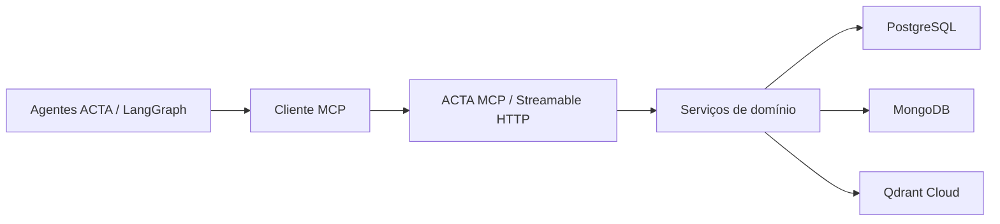

# ACTA MCP

Servidor MCP monolítico modular que concentra o acesso seguro aos dados do ACTA. Os agentes e a decisão de qual tool chamar permanecem no `acta-ai`; este repositório publica operações de negócio estruturadas sobre PostgreSQL, MongoDB e a documentação autorizada indexada no Qdrant.

## Arquitetura



O servidor usa Streamable HTTP stateless em `/mcp`, conforme a recomendação do SDK MCP oficial. Cada requisição recebe `usuario_id`, `empresa_id`, permissões e `trace_id` do contexto autenticado. Nenhuma tool aceita a empresa como fonte de verdade.

## Domínios e tools

- Ciclos: 8 tools.
- Tarefas: 8 tools.
- Colaboradores: 10 tools.
- Formulários: 4 tools.
- Relatórios: 4 tools somente de leitura.
- Predições: 10 tools com scikit-learn e validação de amostra mínima.
- RAG/FAQ: 1 tool.

Total: 56 tools, além dos resources `acta://catalog/tools`, `acta://schema/database` e `acta://documentation`, e dos prompts `analisar_ciclo` e `gerar_relatorio_ciclo`.

Não são publicadas tools de SQL livre nem de consulta genérica ao MongoDB.

## Execução local

Pré-requisito: Docker Desktop, Python 3.11+ e um cluster Qdrant Cloud com Inference habilitado.

```powershell
Copy-Item .env.example .env
docker compose up -d --wait
python -m venv .venv
.\.venv\Scripts\python.exe -m pip install -e ".[dev]"
$env:ACTA_AUTH_MODE = "disabled"
.\.venv\Scripts\python.exe -m acta_mcp.main --transport http
```

Endpoints:

- MCP: `http://127.0.0.1:8000/mcp`
- Saúde: `http://127.0.0.1:8000/health`

`ACTA_AUTH_MODE=disabled` só deve ser usado localmente. Em produção, configure `ACTA_AUTH_MODE=api_key` e `ACTA_MCP_API_KEY`.

## Testes

Os bancos de teste usam dados de duas empresas para validar isolamento de tenant.

```powershell
docker compose up -d --wait
.\.venv\Scripts\python.exe -m pytest -q
.\.venv\Scripts\ruff.exe check src tests
```

A suíte executa:

- testes unitários de validação, segurança e recuperação documental;
- todas as 56 operações contra PostgreSQL e MongoDB locais e Qdrant Cloud;
- tentativas de acesso a ciclo, tarefa e colaborador de outra empresa;
- handshake MCP, descoberta das 56 tools e chamadas reais por Streamable HTTP.

## Integração com `acta-ai`

Configure no cliente:

```env
ACTA_MCP_URL=http://127.0.0.1:8000/mcp
ACTA_MCP_API_KEY=mesmo-segredo-do-servidor
ACTA_MCP_USUARIO_ID=1
ACTA_MCP_EMPRESA_ID=1
ACTA_MCP_PERMISSOES=read
```

Os módulos em `acta-ai/tools/` são apenas proxies LangChain. SQL, queries MongoDB, recuperação documental e regras de autorização ficam neste servidor.

Consulte [arquitetura](docs/architecture.md), [autenticação](docs/authentication.md), [catálogo de tools](docs/tools.md) e [deploy](docs/deployment.md).
