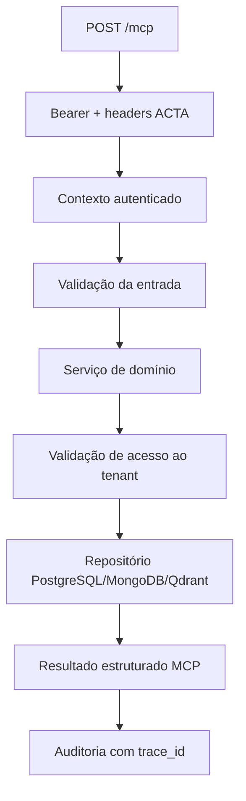

# Arquitetura

O ACTA MCP é um monólito modular com separação hexagonal:

- `core`: configuração, autenticação, contexto, logging e tratamento de erros;
- `infrastructure`: pools e adaptadores PostgreSQL/MongoDB/Qdrant, serialização e auditoria;
- `modules`: contratos, repositórios, serviços e portas MCP por domínio;
- `resources` e `prompts`: contexto legível e fluxos reutilizáveis;
- `registry.py`: composição central das 28 tools;
- `server.py`: container, lifecycle e transporte.

## Fluxo de chamada

O `acta-ai` continua responsável por LangGraph, roteamento, prompts, memória e resposta final. O MCP não contém agentes nem LLM.
