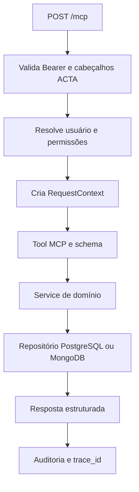

# Arquitetura

## Objetivo e fronteiras

O ACTA MCP é um monólito modular. Ele publica operações de negócio por MCP e mantém
as integrações de infraestrutura fora da camada conversacional. Agentes, prompts,
roteamento e resposta final pertencem ao `acta-ai`; este repositório não escolhe qual
tool um agente deve chamar.

| Camada | Responsabilidade |
| --- | --- |
| `core` | Configuração, contexto de requisição, autenticação, erros e execução auditada. |
| `modules` | Schemas, services, repositories e tools por domínio. |
| `infrastructure` | Clientes e adaptadores de PostgreSQL, MongoDB, Qdrant e observabilidade. |
| `registry.py` | Registro único de tools, resources e prompts. |
| `server.py` | Container, lifecycle ASGI, endpoint de saúde e transporte MCP. |

## Ciclo HTTP

Em cada inicialização HTTP, o lifecycle abre o pool PostgreSQL e verifica MongoDB.
`GET /health` verifica PostgreSQL e MongoDB; retorna `503` se algum deles estiver
indisponível. O FAQ usa o índice Qdrant quando configurado e mantém busca lexical
na documentação local como fallback.

## Fontes de dados

- **PostgreSQL:** entidades transacionais do ACTA, permissões, ciclos, tarefas,
  colaboradores, treinamentos e predições.
- **MongoDB:** formulários e documentos dos domínios operacionais do MCP.
- **Qdrant:** índice vetorial opcional para a documentação consultada pelo FAQ MCP.

## Isolamento e autorização

O `RequestContext` contém `usuario_id`, `empresa_id`, permissões e `trace_id`.
Services e repositories aplicam esses valores nas consultas. Em especial, a memória
filtra simultaneamente usuário e empresa em MongoDB e Qdrant. O cliente não escolhe
o nível de acesso; ele é derivado de `usuario_sistema.tipo_usuario`. O FAQ consulta
apenas documentos conceituais publicados, sem acesso aos dados privados dos ciclos.

Consulte [Autenticação](authentication.md) para os níveis e cabeçalhos exigidos.
